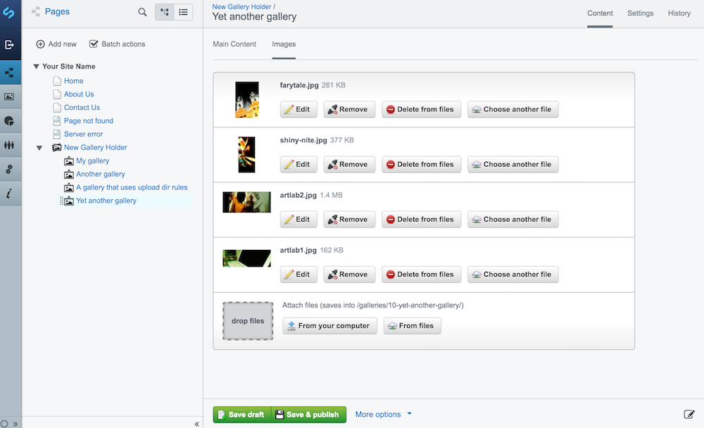

# SilverStripe Gallery

A simple gallery backend for SilverStripe 3 with advanced directory saving rules.

Features:

* Bulk upload
* Drag'n'drop sorting
* Gallery directories are auto created based on your settings
* Can be used on pages as well as data objects


For a ready-to-use gallery also install the [Gallery Pagetypes module](https://github.com/titledk/silverstripe-gallery-pagetypes).




Requires:

* Upload Dir Rules
* Sortable File


## Installation

The `GalleryExtension` can be added to _any_ `DataObject`.  
Add the following to your `config.yml`:

Basics:

```yml
MyDataObject:
  extensions:
    - GalleryExtension
    #this is for the upload dir rules dependency, which takes care of
    #the relation between the gallery and it's folder
    #only needed on DataObjects, as this is added automatically to SiteTree 
    - AssetsFolderExtension
```
